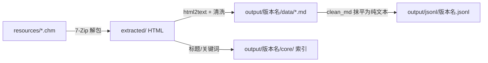

# Wwise CHM 文档处理流程：CHM → Markdown → JSONL

本文记录将 Wwise 帮助文档（`.chm`）转换为微调语料（`.jsonl`）的完整流程。
整条链路分两个阶段，分别由两个入口脚本驱动：

| 阶段 | 脚本 | 输入 | 输出 |
| --- | --- | --- | --- |
| ① 解包转换 | `chm_to_markdown.py`（核心逻辑在 `chm_converter/` 包） | `resources/*.chm` | `output/<版本名>/{data,core}/` |
| ② 语料清洗 | `md_to_jsonl.py` | `output/<版本名>/data/*.md` | `output/jsonl/<版本名>.jsonl` |

本仓库当前已处理的三份 Wwise CHM：

| CHM | 页面数（`data/*.md`） | JSONL 行数 |
| --- | --- | --- |
| `WwiseHelp_en.chm` | 1026 | 1026 |
| `WwiseSDK-Windows.chm` | 9415 | 9415 |
| `Wwise_UE_Integration_en.chm` | 278 | 278 |
| 合计 | 10719 | 10719 |

---

## 阶段一：CHM → Markdown

入口 `chm_to_markdown.py`，核心异步管线在 `chm_converter/pipeline.py` 的
`process_chm_file` / `process_all_chm_files`。

### 处理步骤

1. **解包（`extractor.py`）**
   - 用 7-Zip（`7z`/`7za`/`7zz`，跨平台自动探测）把 `.chm` 解压到 `extracted/<版本名>/`。
   - `find_html_folder` 按三种布局定位 HTML：优先 `html/` 子目录 → 根目录平铺 → 递归遍历（兼容深层嵌套布局）。

2. **建立文件字典（`indexer.build_file_dictionary`）**
   - 递归收集所有 `.htm/.html`，用 BeautifulSoup 抽取每页标题。
   - 字典 key 为文件名 stem（`--preserve-structure` 时为相对路径 stem），value 含 `title`、目标 `filename`（`.md`）、`version`（取自 CHM 文件名，如 `WwiseHelp_en`）。
   - 分批处理 + 周期性 GC，避免大文档（9000+ 页）内存溢出。

3. **HTML → Markdown（`md_converter.convert_html_to_markdown`）**
   每页依次执行：
   - `read_file_with_encoding`：用 chardet 自动识别编码（含 UTF-8/GB18030/GBK 等 CJK 回退）。
   - `remove_unwanted_elements`：按 profile 移除指定标签 / class / id。
   - `update_links`：把页面间互引链接重写指向对应 `.md`。
   - `replace_code_snippets`：识别代码块语言并保留为围栏代码（占位符回填）。
   - `html2text` 渲染为 Markdown（`body_width=0` 不折行）。
   - 顶部加 `# <标题> (<版本>)` 一级标题。
   - `fix_tables` 规范化表格、`clean_markdown_formatting` 做通用清洗（折叠空行、heading 后补空格、GUID 重命名、清理 `javascript:` 残链等）。
   - 异步分批写入，受 semaphore 限流，每 50 批 GC 一次。

4. **生成索引（`indexer.create_index_files`）** 写入 `core/`：
   - `file_index.json` — `id → {title, filename, version}` 原始映射。
   - `id_lookup.json` — 小写 key + 抽取关键词，用于全文检索 / RAG。
   - `index.md` — 按字母排序的可读导航页。

5. **清理**：默认删除 `extracted/`（除非 `--keep-html`）。

### 输出目录结构

```
output/
└── <版本名>/                 # 如 WwiseHelp_en
    ├── core/
    │   ├── file_index.json
    │   ├── id_lookup.json
    │   └── index.md
    └── data/
        ├── <Topic1>.md
        ├── <Topic2>.md
        └── ...
```

### Profile 系统（`config.py`）

转换行为由 `ConversionConfig` 控制，内置两个 profile：

- `generic`（默认）— 最小清洗，适配任意 CHM（Wwise 文档用此 profile 即可）。
- `revit` — 针对 Autodesk Revit 帮助查看器的 UI 噪声做额外清洗。

可编程方式自定义 profile（指定 `classes_to_remove` / `ids_to_remove` / `cleanup_patterns` 等）。

### 常用命令

```bash
# 交互式菜单（列出 resources/ 下的 CHM）
uv run python chm_to_markdown.py

# 转换单个文件
uv run python chm_to_markdown.py --single resources/WwiseHelp_en.chm

# 转换 resources/ 下全部 CHM
uv run python chm_to_markdown.py --all

# 性能调优 / 保留 HTML 调试 / 保留目录层级
uv run python chm_to_markdown.py --all --workers 4 --batch-size 25 --semaphore 10
uv run python chm_to_markdown.py --single resources/WwiseSDK-Windows.chm --keep-html
uv run python chm_to_markdown.py --single resources/WwiseSDK-Windows.chm --preserve-structure
```

| 参数 | 简写 | 默认 | 说明 |
| --- | --- | --- | --- |
| `--single FILE` | `-s` | — | 转换单个 CHM |
| `--all` | `-a` | — | 转换 `resources/` 下全部 CHM |
| `--profile` | `-p` | `generic` | 转换 profile：`generic` / `revit` |
| `--keep-html` | `-k` | off | 转换后保留解包出的 HTML |
| `--workers N` | `-w` | `8` | CPU 转换线程数 |
| `--batch-size N` | `-b` | `50` | 每个异步批次的文件数 |
| `--semaphore N` | — | `20` | 最大并发 I/O 数 |
| `--preserve-structure` | — | off | 在 `data/` 中镜像 CHM 原始目录层级 |

> 前置依赖：Python 3.10+ 与 7-Zip（Linux：`sudo apt install p7zip-full`）。

---

## 阶段二：Markdown → JSONL

入口 `md_to_jsonl.py`，把阶段一产出的 `output/<版本名>/data/*.md`
汇总成单个 `output/jsonl/<版本名>.jsonl`，**每个 md 文档一行** `{"text": "..."}`。

目的：把面向文档浏览的 Markdown（带导航、互引链接、图片、HTML 转换残留）
抹平为适合 LLM 微调的纯文本。

### 清洗规则（`clean_md`）

| 规则 | 处理 |
| --- | --- |
| 首行重复标题 | 删除开头的 `# Title (Version)`（正文里另有同名 heading） |
| 面包屑导航行 | 删除前 6 行内含 ` > ` 且带页面链接的行 |
| 内部 / 页面互引链接 | `[text](xxx.md\|.html\|#anchor)` → 纯文字 `text` |
| 外部链接 | `[text](http(s)://...)` → 仅保留锚文本 `text`，去掉 URL |
| 图片 | `` → 删除 |
| 异形 heading | `# ## text` → `## text`，`#  text` → `# text` |
| 退化提示框表格 | 空表头 `\| Note \|` + 多余分隔行 → `**Note**` |
| 重复表格分隔行 | 连续两行 `\| --- \|` 保留一行 |
| 尾部分割线 | 去掉结尾 `* * *` |
| 多余空行 | 连续 3+ 空行压缩为 2 |

> 链接降级用迭代替换（最多 5 轮），以处理 html2text 产生的嵌套链接畸形（如 `[_[name](a.html)_](b.html)`）。
> 清洗后为空的文档会被跳过（不写入 JSONL）。

### 常用命令

```bash
# 转换单个版本目录
uv run python md_to_jsonl.py output/WwiseHelp_en

# 转换多个版本（各自输出一个 jsonl）
uv run python md_to_jsonl.py output/WwiseHelp_en output/WwiseSDK-Windows output/Wwise_UE_Integration_en

# 指定输出目录（默认 output/jsonl/）
uv run python md_to_jsonl.py output/WwiseHelp_en -o corpus
```

### 输出示例

```
output/jsonl/
├── WwiseHelp_en.jsonl
├── WwiseSDK-Windows.jsonl
└── Wwise_UE_Integration_en.jsonl
```

每行形如：

```json
{"text": "# 标题\n\n正文段落...\n\n## 小节\n..."}
```

---

## 端到端复现

```bash
# 0. 把 Wwise CHM 放入 resources/
#    resources/WwiseHelp_en.chm  resources/WwiseSDK-Windows.chm  resources/Wwise_UE_Integration_en.chm

# 1. CHM → Markdown（全部）
uv run python chm_to_markdown.py --all

# 2. Markdown → JSONL（全部版本）
uv run python md_to_jsonl.py output/WwiseHelp_en output/WwiseSDK-Windows output/Wwise_UE_Integration_en

# 产物：output/jsonl/*.jsonl 即微调语料
```

